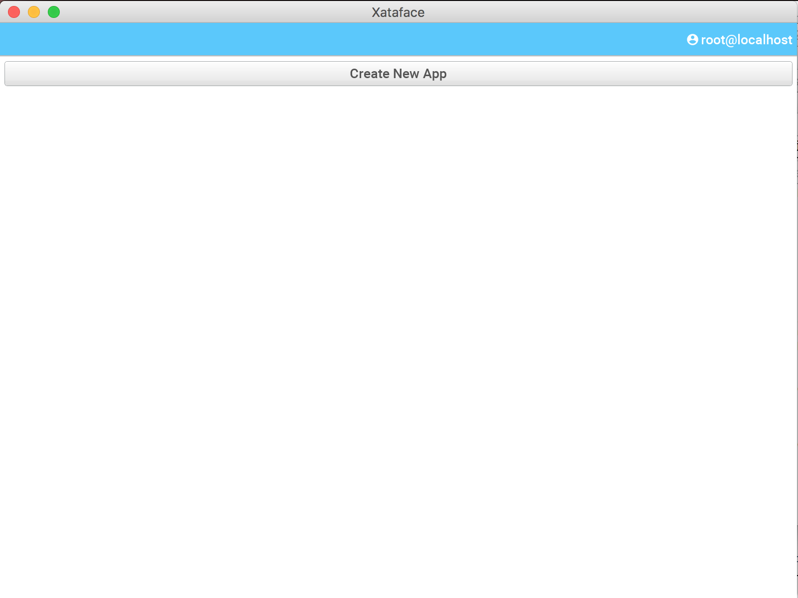

Under construction.  See [xataface.com](http://xataface.com/wiki)

## Using the CLI Tool

### Creating a new project from scratch

~~~~
xataface create /var/www/html/helloworld
~~~~

Follow the prompts to create your first app:

~~~~
Database 'helloworld' doesn't exist.  Create it? (Y/n)[Y]:
User `helloworld@localhost` does not exist.  Create it? (Y/n)[Y]:
Creating user helloworld at localhost with password dagjx_sQtn8zsg
Granting ALL privileges on database helloworld to helloworld @ localhost
Installing xataface at helloworld/xataface
/Users/shannah/.xataface/src/master.zip
Copying files from helloworld/xataface/site_skeleton to helloworld
~~~~

This example would have created the following:

1. Application at `/var/www/html/helloworld`
2. A database named "helloworld"
3. A user with permissions on the "helloworld" database named "helloworld", allowed to connect from localhost.

**Directory Structure**

~~~~
Steves-MacBook-Pro:tmp shannah$ find helloworld | grep -v xataface/
helloworld
helloworld/.gitignore
helloworld/.htaccess
helloworld/conf.db.ini
helloworld/conf.ini
helloworld/index.php
helloworld/templates_c
helloworld/Web.config
helloworld/xataface
~~~~

### Cloning an existing project from Github

~~~~
xataface clone <repo url> <dest dir>
~~~~

E.g. To clone the [Faculty of Widgetry demo](https://github.com/shannah/faculty_of_widgetry)

~~~~
xataface clone \
    https://github.com/shannah/faculty_of_widgetry \
    faculty_of_widgetry
~~~~

### Creating App on Existing database

~~~~
xataface create faculty_of_widgetry
Found database 'faculty_of_widgetry.  Use this database for the app? (Y/n):[Y]
User `faculty_of_widgetry@localhost` does not exist.  Create it? (Y/n)[Y]:
Creating user faculty_of_widgetry at localhost with password zB3dm@kicxfybk
Granting ALL privileges on database faculty_of_widgetry to faculty_of_widgetry @ localhost
Installing xataface at faculty_of_widgetry/xataface
/Users/shannah/.xataface/src/master.zip
Copying files from faculty_of_widgetry/xataface/site_skeleton to faculty_of_widgetry
~~~~

## Using the GUI Wizard

~~~~
xataface wizard
~~~~

This will open a window as shown below:

